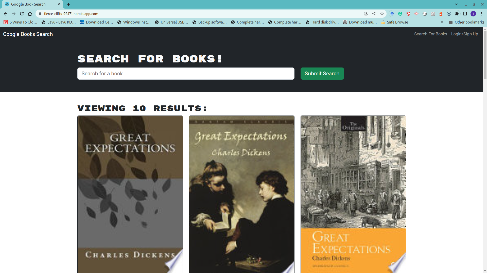
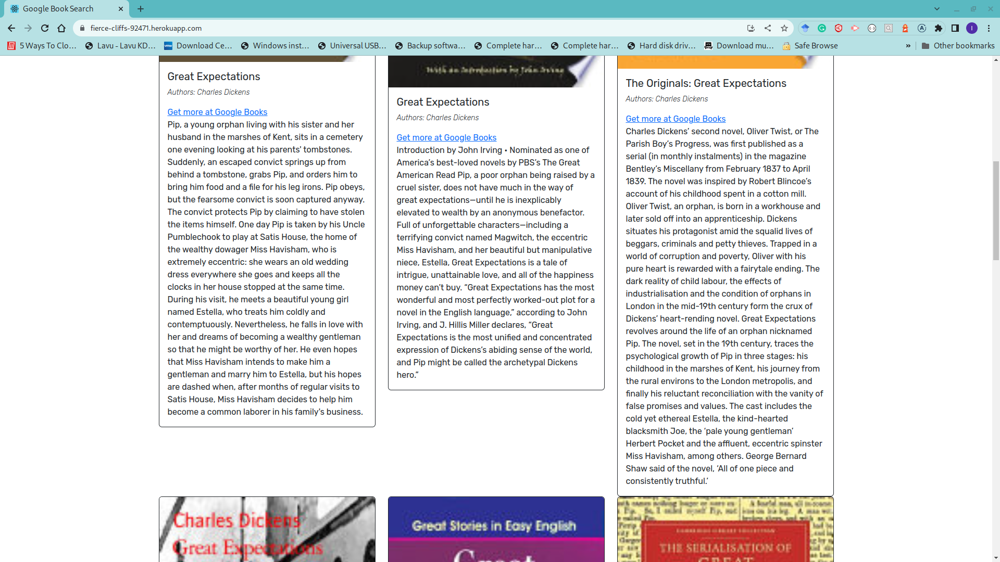
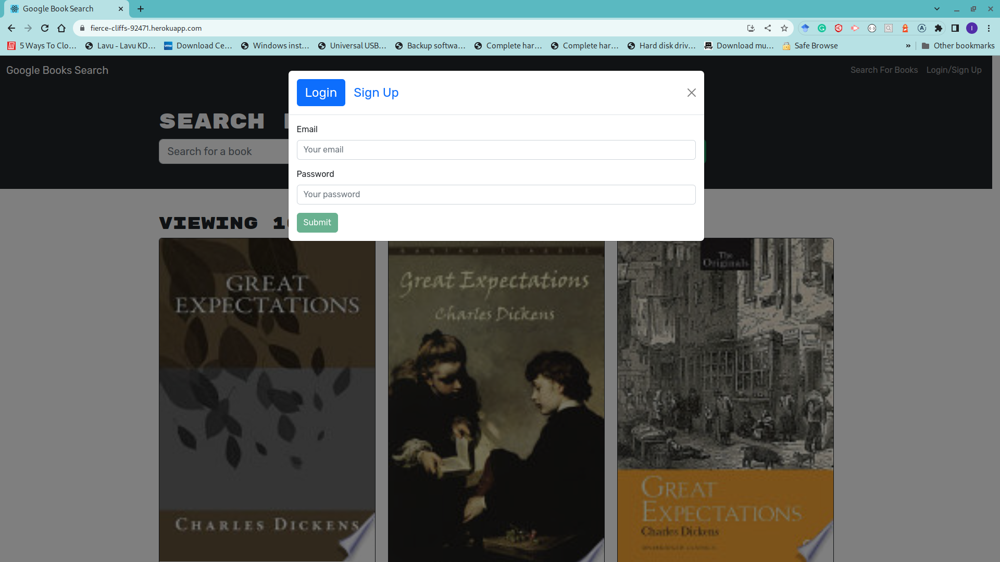
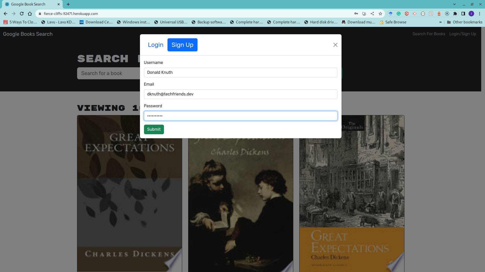
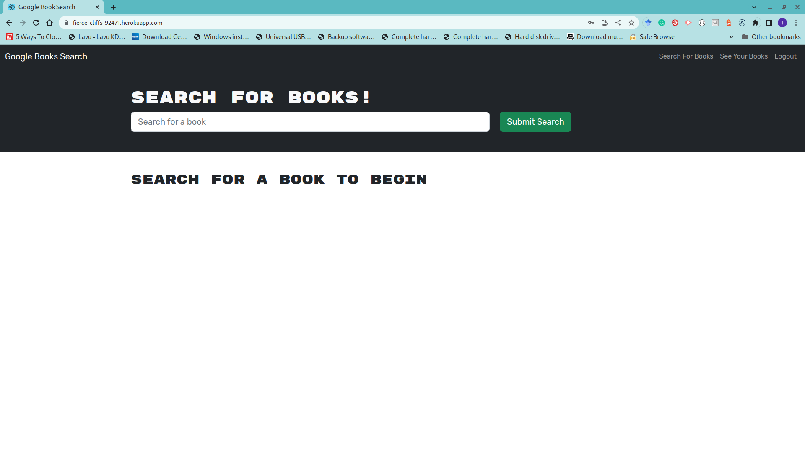
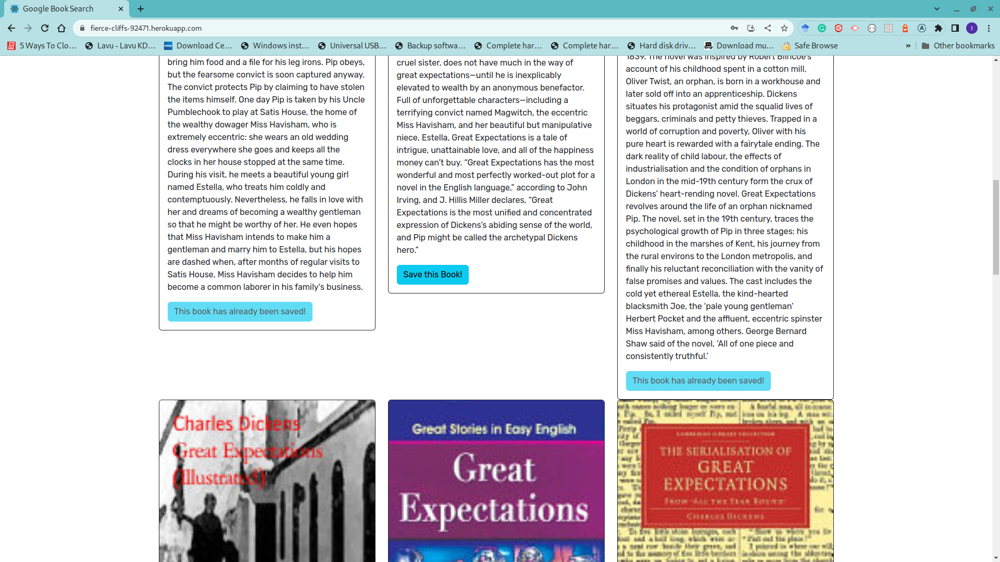
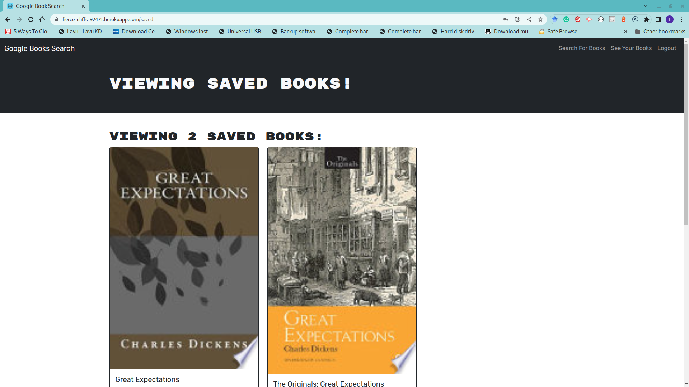
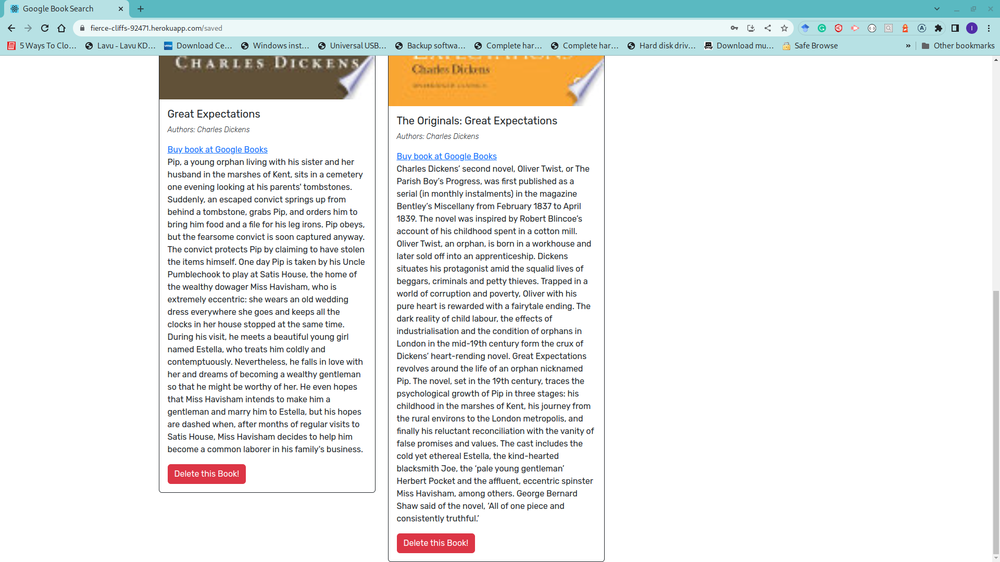

# booksearchengine
This app converts an App built with a RESTful API back end to GraphQL API with Apollo Server.

       

## Description

This project converts a fully functioning Google Books API search engine built with a RESTful API to one using GraphQL API built with Apollo Server. The app was built using the MERN stack with a React front end, MongoDB database, and Node.js/Express.js server and API. The application allow users to save their favorite book and follow-up to the books link at Google Books to purchase it or get more information. 

My objectives for this application is based on the following user story and acceptance criteria;

### User Story

```md
AS A social media startup
I WANT an API for my social network that uses a NoSQL database
SO THAT my website can handle large amounts of unstructured data
```

## Acceptance Criteria

```md
GIVEN a book search engine
WHEN I load the search engine
THEN I am presented with a menu with the options Search for Books and Login/Signup and an input field to search for books and a submit button
WHEN I click on the Search for Books menu option
THEN I am presented with an input field to search for books and a submit button
WHEN I am not logged in and enter a search term in the input field and click the submit button
THEN I am presented with several search results, each featuring a book’s title, author, description, image, and a link to that book on the Google Books site
WHEN I click on the Login/Signup menu option
THEN a modal appears on the screen with a toggle between the option to log in or sign up
WHEN the toggle is set to Signup
THEN I am presented with three inputs for a username, an email address, and a password, and a signup button
WHEN the toggle is set to Login
THEN I am presented with two inputs for an email address and a password and login button
WHEN I enter a valid email address and create a password and click on the signup button
THEN my user account is created and I am logged in to the site
WHEN I enter my account’s email address and password and click on the login button
THEN I the modal closes and I am logged in to the site
WHEN I am logged in to the site
THEN the menu options change to Search for Books, an option to see my saved books, and Logout
WHEN I am logged in and enter a search term in the input field and click the submit button
THEN I am presented with several search results, each featuring a book’s title, author, description, image, and a link to that book on the Google Books site and a button to save a book to my account
WHEN I click on the Save button on a book
THEN that book’s information is saved to my account
WHEN I click on the option to see my saved books
THEN I am presented with all of the books I have saved to my account, each featuring the book’s title, author, description, image, and a link to that book on the Google Books site and a button to remove a book from my account
WHEN I click on the Remove button on a book
THEN that book is deleted from my saved books list
WHEN I click on the Logout button
THEN I am logged out of the site and presented with a menu with the options Search for Books and Login/Signup and an input field to search for books and a submit button
```

## Table of Contents

- [Description](#description)
- [Usage](#usage)
- [Questions](#questions)
- [License](#license)

---

## Usage

The application is hosted on heroku at [https://fierce-cliffs-92471.herokuapp.com/](https://fierce-cliffs-92471.herokuapp.com/)

Once there, the landing page is presented as below;


While not logged in, the visitor can perform a search for their favorite books. 



The visitor can follow the links on the page to go to Google for more information but they can't save any book from their search.



If the visitor clicks the login/Sign Up navbar link, they get presented with a modal for signing up or logging in


The sign up tab allows the user to provide their username, email, and password to create an account.



Once the sign up is successful, the user get redirected to the search page with new options to view their saved books.



Once logged in, the user can save any favorite book from the search.



The user can view their previously saved books from their search.




The user can delete any book or follow a link to purchase the book at Google Books. 




## Questions

If you have any questions, please feel free to reach out to me at: [ikubiti@icloud.com](mailto:ikubiti@icloud.com).

Alternatively, you may find me on GitHub at [https://github.com/ikubiti](https://github.com/ikubiti).

---

## License

Copyright (c) ikubiti. All rights reserved.

Licensed under the [MIT](./LICENSE) license.